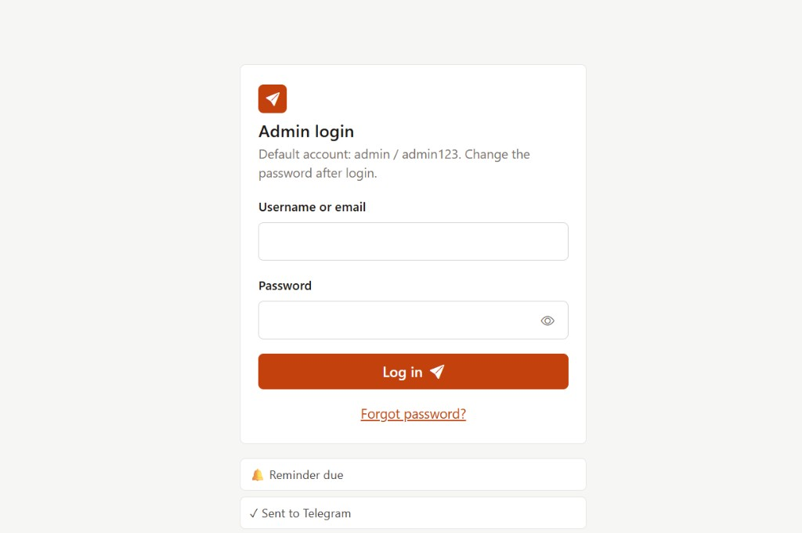
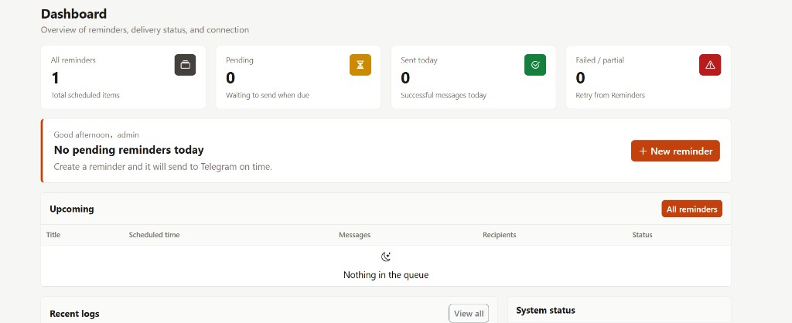
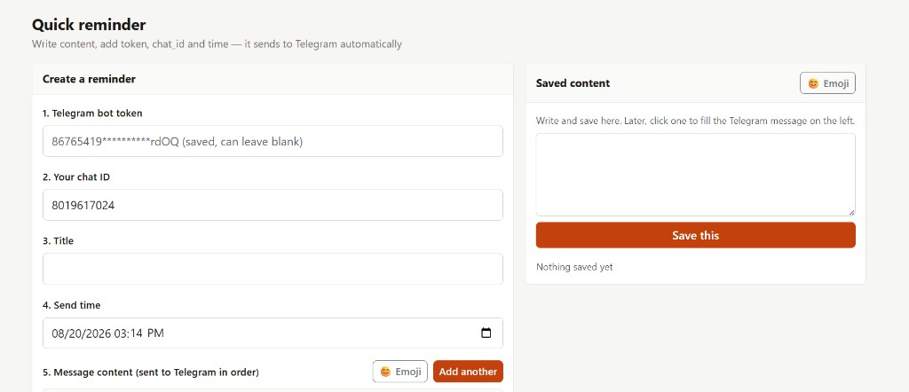
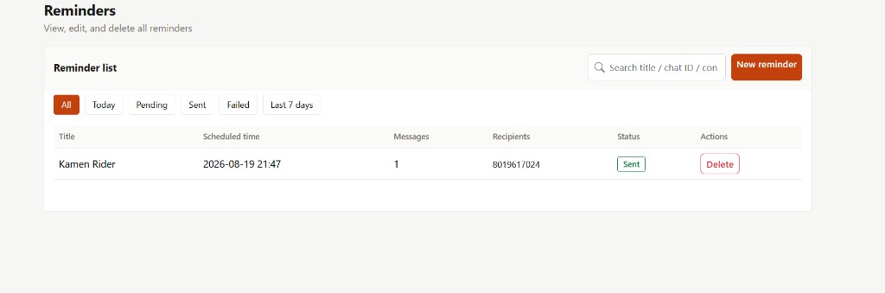
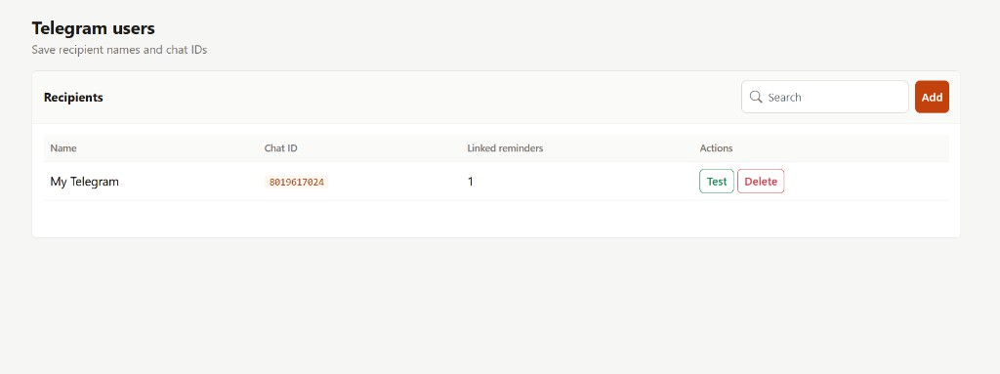
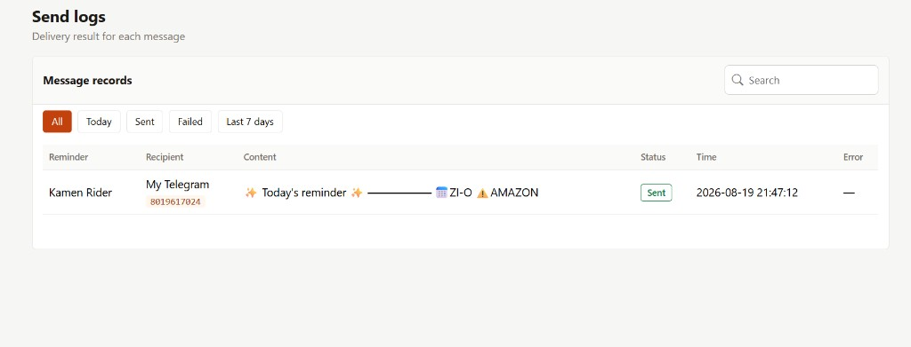
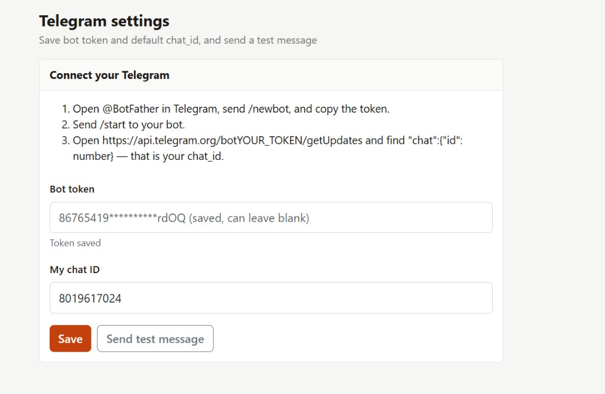
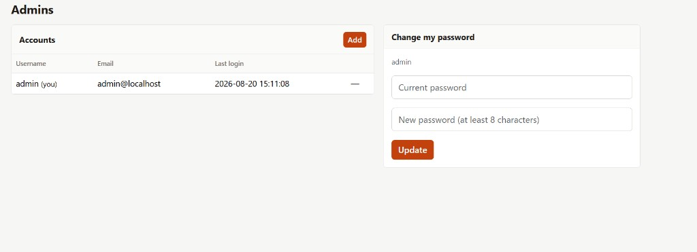

# Screenshots / 界面截图

Admin UI overview for Telegram Reminder.

## 1. Admin login

Default account shown on the page: `admin` / `admin123`. Change the password after first login.

## 2. Dashboard

Overview of reminders, delivery status, and connection health.

## 3. Quick reminder

Create a reminder: bot token, chat ID, title, send time, and message content. Saved content on the right can be reused.

## 4. Reminders

View, filter, edit, and delete all reminders.

## 5. Telegram users

Save recipient names and chat IDs. Test delivery or delete a recipient from the list.

## 6. Send logs

Delivery result for each message (sent / failed, time, error).

## 7. Telegram settings

Save bot token and default chat ID, then send a test message.

## 8. Admins

Manage admin accounts and change your password.

